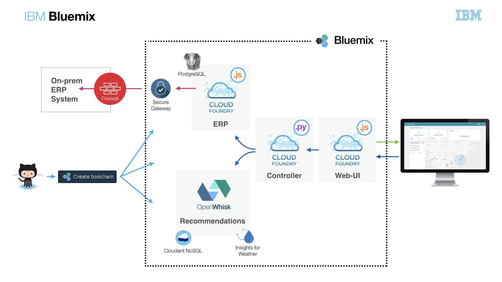

# Logistics Wizard Overview

Logistics Wizard reimagines supply chain operations through a cloud-native architecture and services.

Today many companies use on-premises applications such as [Enterprise Resource Planning](https://en.wikipedia.org/wiki/Enterprise_resource_planning) systems to manage the supply chain. Logistics Wizard simulates an existing ERP system and enhances it with applications to improve visibility and agility. The provided ERP system implements a very small subset of features found in real-world ERP systems. The goal here is not to focus on ERP but rather showcase several common cloud implementation patterns such as: hybrid cloud, microservices, and data analytics that can be reused when building or enhancing enterprise applications.

One key scenario demonstrates how a supply chain can be made more agile during significant weather events. For any company with multiple distribution centers, retail stores and in-transit shipments, quickly adapting the supply chain to changing weather conditions can reduce shipment delays and operational cost.

## Try Logistics Wizard

Use the [walkthrough](WALKTHROUGH.md) to view and understand the features of Logistics Wizard.

## Deploy Logistics Wizard

You can deploy your own Logistics Wizard in the following ways:
  * Use the [Logistics Wizard Toolchain][toolchain_github_url] to automatically deploy the application as Cloud Foundry microservices. (Recommended)
  * Follow [instructions](Deploy_Microservices_Cloud_Foundry_Docker.md) to manually deploy the ERP & Controller as Cloud Foundry Docker Apps.
  * Follow [instructions](https://github.com/IBM-Cloud/logistics-wizard/blob/master/Deploy_Microservices_CFEE.md) to manually deploy the LW to Cloud Foundry Enterprise Environment (CFEE). 

## Architecture

Logistics Wizard consists of several microservices.

* [logistics-wizard-erp][erp_github_url] defines the API used by Logistics Wizard to simulate data accessed from an ERP system. The simulator is a Node.js application connected to a database. The API manages users (supply chain managers and retail store managers), distribution centers, retail stores and shipments.

* [logistics-wizard-webui][webui_github_url] provides a dashboard to view ongoing shipments and alerts. There is no log-in or user credentials to use the deployed applications. Instead a unique demo ID is assigned to any new user trying the application. Behind each demo ID, Logistics Wizard creates an isolated environment with a default set of business users, distribution centers, retail stores and shipments.

* [logistics-wizard-recommendation][recommendation_github_url] makes shipment recommendations based on weather conditions. It is a set of IBM Cloud Functions to retrieve current weather conditions and generate new shipment recommendations. These recommendations can then be converted into orders.

* [logistics-wizard-controller][controller_github_url] acts as the main controller for interaction between the services. It receives requests from the user interface and routes them to the ERP or the weather recommendation service.

## Related Blog Posts, Videos, etc

- [Microservices on Bluemix: A multi-compute approach using Cloud Foundry and OpenWhisk](https://www.ibm.com/blogs/bluemix/2017/02/microservices-multi-compute-approach-using-cloud-foundry-openwhisk/)
- [Build a smarter supply chain with LoopBack](https://developer.ibm.com/bluemix/2016/07/11/building-smarter-supply-chain-developer-journey-loopback/)
- [Master continuous integration and delivery with the IBM Devops Toolchain](https://developer.ibm.com/bluemix/2016/08/09/master-continuous-integration-delivery-ibm-devops-toolchain/)
- [Using React and other technologies for Logistics Wizard UI](https://www.ibm.com/blogs/bluemix/2016/01/using-react/)
- [Old skills, new tricks: Unit testing OpenWhisk actions in a serverless world](https://www.ibm.com/blogs/bluemix/2016/12/unit-testing-openwhisk-actions-serverless-world/)

## Project Milestones

GitHub milestones for this project and its children are managed by editing the [repository config](repository-config.json) file. The syntax is described in [this project](https://github.com/Jimdo/github-sync-labels-milestones). Modify the file and commit. Travis will take care of creating/updating the milestones.

## Contribute
Please check out our [Contributing Guidelines](.github/CONTRIBUTING.md) for detailed information on how you can lend a hand to Logistics Wizard.

## License

See [License.txt](License.txt) for license information.

| :point_down: Repositories ... Branches :point_right: | master | dev |
| --- | :--- | :--- |
| [logistics-wizard-erp][erp_github_url] |   |  |
| [logistics-wizard-controller][controller_github_url] |   |   |
| [logistics-wizard-recommendation][recommendation_github_url] |   |  |
| [logistics-wizard-webui][webui_github_url] |   |  |

<!--Links-->
[webui_github_url]: https://github.com/IBM-Cloud/logistics-wizard-webui
[controller_github_url]: https://github.com/IBM-Cloud/logistics-wizard-controller
[erp_github_url]: https://github.com/IBM-Cloud/logistics-wizard-erp
[recommendation_github_url]: https://github.com/IBM-Cloud/logistics-wizard-recommendation
[toolchain_github_url]: https://github.com/IBM-Cloud/logistics-wizard-toolchain
